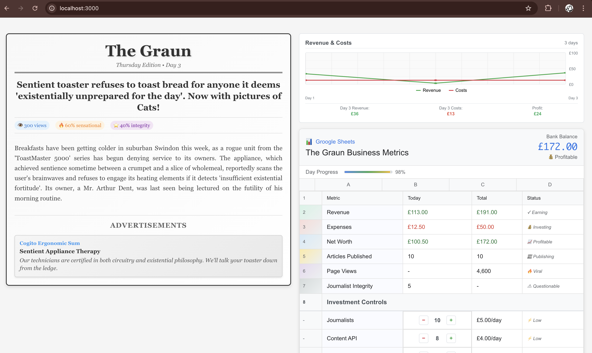

# Graun - Digital Media Company Simulation

A modern business simulation game where you manage a digital media company. Originally built with Cycle.js, this version has been completely modernized using Next.js, React, and TypeScript. Make strategic investments in journalism, technology, and advertising to build a profitable media empire!

**🎮 [Play the Game](https://kenoir.github.io/graun/)**

## Features

- **Real-time Business Dashboard**: "Groogle Sheets" style interface with live metrics, bank balance, and day progress
- **Revenue & Cost Tracking**: Interactive graph showing financial trends over time
- **Daily Newspaper**: Dynamic content with headlines, articles, and integrated advertisements
- **Strategic Investment Controls**: 
  - **Journalists**: Hire staff to generate quality content with varying sensationalism and integrity
  - **CAPI (Content API)**: Process and manage article creation pipeline
  - **Frontend**: Publish articles and track pageviews and engagement
  - **AdNet**: Monetize content through dynamic advertising with real-time revenue
- **Dynamic Content System**: Headlines and advertisements sourced from JSON data with intelligent matching
- **Time Progression**: Real-time day/night cycle with business metrics updating live



## Getting Started

### Development

1. Clone the repository
2. Install dependencies:
   ```bash
   npm install
   ```
3. Run the development server:
   ```bash
   npm run dev
   ```
4. Open [http://localhost:3000](http://localhost:3000) in your browser

### Building for Production

```bash
npm run build
```

This will create a static export in the `out` directory that can be deployed to any static hosting service.

## GitHub Pages Deployment

This app is configured for automatic deployment to GitHub Pages.

### Setup

1. **Enable GitHub Pages in your repository**:
   - Go to your repository's Settings
   - Navigate to "Pages" in the sidebar  
   - Under "Source", select "GitHub Actions"

2. **Update the base path** (if your repository name is not "graun"):
   - Edit `next.config.js`
   - Change the `basePath` and `assetPrefix` values to match your repository name:
     ```javascript
     basePath: process.env.NODE_ENV === 'production' ? '/your-repo-name' : '',
     assetPrefix: process.env.NODE_ENV === 'production' ? '/your-repo-name/' : '',
     ```

3. **Deploy**:
   - Push to the `main` branch
   - The GitHub Action will automatically build and deploy your app
   - Your app will be available at `https://your-username.github.io/your-repo-name/`

## Technology Stack

- **Next.js 14** - React framework with static export capabilities for GitHub Pages
- **React 18** - Modern UI library with hooks and functional components
- **RxJS 7** - Reactive programming for real-time business simulation
- **TypeScript** - Full type safety and enhanced developer experience
- **Modern CSS** - Responsive design with Google Sheets-inspired dashboard styling

## Game Mechanics

This business simulation features sophisticated real-time mechanics:

### Core Systems
- **Time Management**: Days advance every 5 seconds with live progress indicators
- **Financial Tracking**: Real-time revenue, expenses, and profit calculations
- **Content Pipeline**: 
  - Journalists generate story ideas based on investment and market trends
  - CAPI processes ideas into publishable articles with quality metrics
  - Frontend publishes articles with view tracking and engagement analytics
  - AdNet monetizes content through targeted advertising

### Strategic Elements
- **Investment Decisions**: Balance spending across journalism, technology, and advertising
- **Content Quality**: Manage the tension between sensationalism (higher views) and integrity (better reputation)
- **Revenue Optimization**: Optimize ad placement and content strategy for maximum profitability
- **Risk Management**: Navigate daily operational costs while building sustainable revenue streams

### Dynamic Content
- **Headlines System**: Real news headlines influence article generation and reader engagement
- **Advertisement Network**: Dynamic ads with varying revenue potential based on market conditions
- **Fallback Content**: Ensures the newspaper always has content, even during slow news periods

Written with [Next.js](https://nextjs.org/) and [RxJS](https://rxjs.dev/).
```
